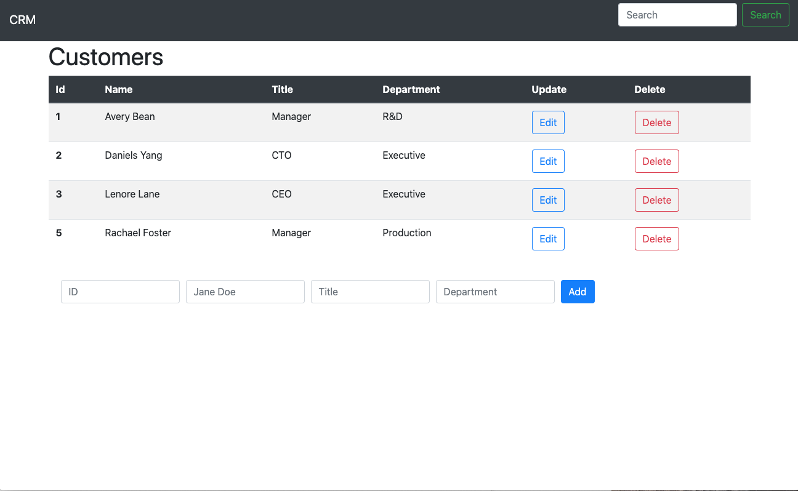

# Customer REST API 
Spring Web API Framework 
use to test Docker and Kubernetes Microservices 

Example solution:

/web/index.html

 


````
                         ---------------
                          Web Page HTML
                             (link)
                         ---------------
                                |
                                | 
                    ----------------------------
                    Load balancer port 80:8080 
                    ----------------------------
                       |                   |
    --------------------------      --------------------------
      Customer-API Port 8080          Customer-API Port 8080 
    --------------------------      --------------------------  
                    

````


Compile code run:

````
mvn clean install
````

Run the application on workstation:

````
java -jar target/customer-api-1.0.0.jar
````

Create a Docker image:

````
docker build -t customer-api:xxx .
````
Create a docker container from image: 

````
docker run -d -p 8080:8080 --name customer-api customer-api:xxx
````

Create a Kubernetes Deployment:

````
kubectl create -f customer-api-deployment.yml 
````
Create a Kubernetes Service:

````
kubectl create -f loadblancer-customer-api.yml
````


## Usage: 

Get all Customers:

````
GET http://{servername}:8080/customer-api/v1/customers/all
````

Get Customer by id:

````
GET http://{servername}:8080/customer-api/v1/customer/{id}
````

Add a Customer 

````
POST http://{servername}:8080/customer-api/v1/customers

Header: application/json

    {
        "id": 3,
        "name": "John Doe",
        "title": "Manager",
        "department": "RMM"
    }


````
Update Customer by id

````
PUT http://{servername}:8080/customer-api/v1/customers/{id}

Header: application/json

    {
        "name": "John Doe",
        "title": "Manager",
        "department": "RMM"
    }
````
Delete a Customer by id


````
DELETE http://{servername}:8080/customer-api/v1/customer/{id}
````

Search Customer name:

`````
GET  http://{servername}:8080/customer-api/v1/customer/name/{name}
`````

